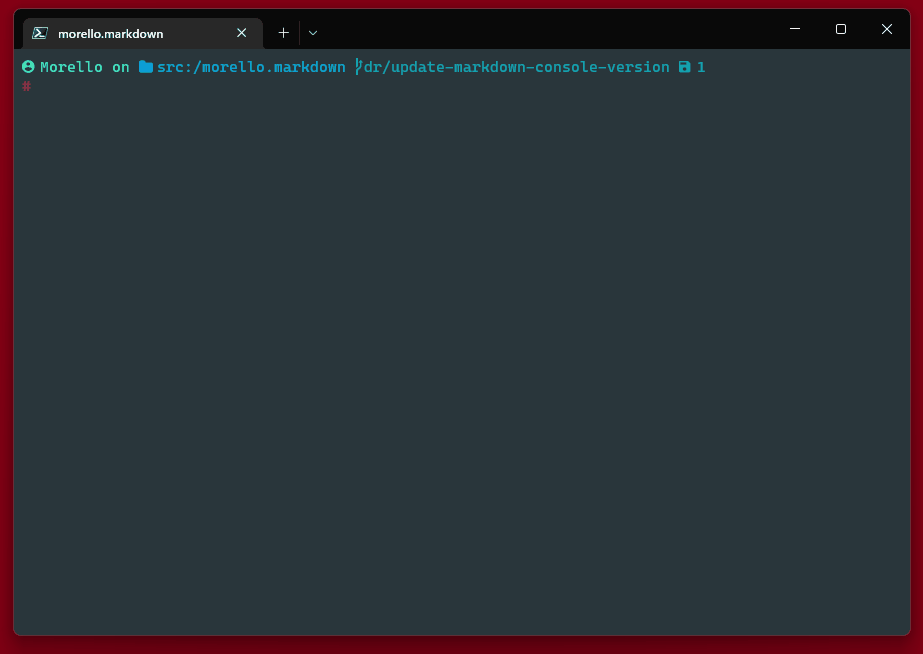

#  Morello Markdown

[](https://github.com/David-Rushton/morello.markdown/actions/workflows/markdown_console_on_pull_request_to_main.yml)
[](https://github.com/David-Rushton/morello.markdown/actions/workflows/markdown_console_on_push_to_main.yml)


[](https://github.com/David-Rushton/morello.markdown/actions/workflows/markdown_cli_on_pull_request_to_main.yml)
[](https://github.com/David-Rushton/morello.markdown/actions/workflows/markdown_cli_on_push_to_main.yml)  


---

##  Summary

Tools for beautifully rendering markdown in your terminal.

| Tool              | What does it do?                                           | Get It                                                                 |
| ----------------- | ---------------------------------------------------------- | ---------------------------------------------------------------------- |
| `MarkdownCli`     | CLI app powered by `MarkdownConsole`                       | [Download](https://github.com/David-Rushton/morello.markdown/releases) |
| `MarkdownConsole` | .Net library for pretty printing markdown in your terminal | [Download](https://www.nuget.org/packages/Morello.MarkdownConsole/)    |

##  Contents

- [`MarkdownCli`](#-markdowncli)
  - [Getting Started](#getting-started)
  - [Build From Source](#build-from-source)
  - [Download](#download)
- [`MarkdownConsole`](#-markdownconsole)
  - [Download Package](#download-package)
- [Acknowledgments](#-acknowledgments)
  - [Optional Extras](#optional-extras)  
- [Contact Us](#-contact-us)

---

##  `MarkdownCli`

A CLI app that beautifully renders markdown in your terminal.



### Getting Started

```bash
# You can pipe input
$ "*bold text*" | md-cli

# Or pass as an arg
$ md-cli "_italic text_"

# We accept files
$ md-cli /path/to/markdown.md
$ /path/to/markdown.md | md-cli
```

### Build From Source

1. You'll need [.Net 6](https://dotnet.microsoft.com/en-us/download)
1. Navigate to [./src/markdown-cli/](./src/markdown-cli/)
1. `dotnet build`

### Download

> You don't need to download anything else.  
> There are no dependencies.

Or you can [download](https://github.com/David-Rushton/morello.markdown/releases) prebuilt binaries.  We support Windows and Linux.  

---

##  `MarkdownConsole`

A .Net library that uses [Ansi Escape Codes](https://en.wikipedia.org/wiki/ANSI_escape_code) to pretty print markdown.

### Download Package

```powershell
# Download from NuGet
# https://www.nuget.org/packages/Morello.MarkdownConsole
> dotnet add package Morello.MarkdownConsole
```

We support [`.Net Standard 2.0`](https://docs.microsoft.com/en-us/dotnet/standard/net-standard?tabs=net-standard-2-0).
This provides great coverage for recent versions of `.Net`, `.Net Core` and `.Net Framework`.
The full list is available [here](https://www.nuget.org/packages/Morello.MarkdownConsole#supportedframeworks-body-tab).

```csharp
using Morello;

public class Program
{
  public static Main(string[] args)
  {
    MarkdownConsole.Write("**bold text**");
  }
}
```

##  Acknowledgments

`MarkdownConsole` uses these amazing projects to make your markdown look its best.

- [Spectre Console](https://github.com/spectreconsole/spectre.console)
- [Markdig](https://github.com/xoofx/markdig)

### Optional Extras

Installing Bat or Nerd Fonts adds extra flourishes.  Don't worry if you don't use these fantastic
projects.  We will still render beautiful markdown in your terminal.

- [Bat](https://github.com/sharkdp/bat)  
  When installed Bat provides colourful syntax highlighting.  
  When not we fallback to a basic highlighter.

- [Nerd Fonts](https://www.nerdfonts.com/)  
  When installed Nerd Fonts add extra decorations to the text.  
  When not we use a mix of colours and styles.

---

##  Contact Us

Please share your feedback❗

- [Email](mailto:sayhello@morello.tools)
- [Twitter](https://twitter.com/DavidRushton55)
- [LinkedIn](https://www.linkedin.com/in/david-rushton-b6923a55/)

Found a 🐛?  Open an [issue](https://github.com/David-Rushton/morello.markdown/issues/new/choose).
