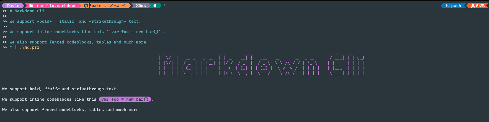

#  Morello Markdown

---

Tools for rendering markdown beautifully in your terminal.

## `MarkdownCli`

A console app that prints markdown in your console.

Powered by [MarkdownConsole](##`MarkdownConsole`).

## `MarkdownConsole`

A .Net library that uses [Ansi Escape Codes](https://en.wikipedia.org/wiki/ANSI_escape_code) tp pretty print markdown.

## Acknowledgments

This library uses these amazing projects to make markdown look its best in your console.

### Dependencies

- [Spectre Console](https://github.com/spectreconsole/spectre.console)
- [Markdig](https://github.com/xoofx/markdig)
 
### Optional

When available, on the local system, Morello Markdown will look its best.
 
- [Bat](https://github.com/sharkdp/bat)  
  If installed we use Bat to provide syntax highlighting.  
  If not we fallback to a basic highlighter.

- [Nerd Fonts](https://www.nerdfonts.com/)  
  We use Nerd Fonts to print non-alphanumeric characters.   

> ⚠️ WARNING ⚠️  
> Nerd Fonts fallback is a bit [messy at the moment](https://github.com/David-Rushton/morello.markdown/issues/1)

### Other

<a href="https://www.flaticon.com/free-icons/cherry" title="cherry icons">Cherry icons created by Freepik - Flaticon</a>
